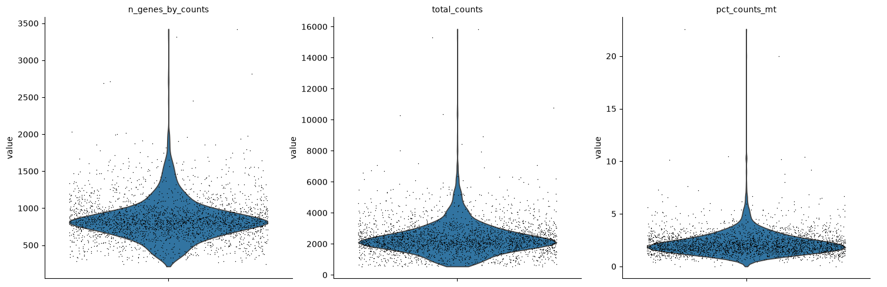
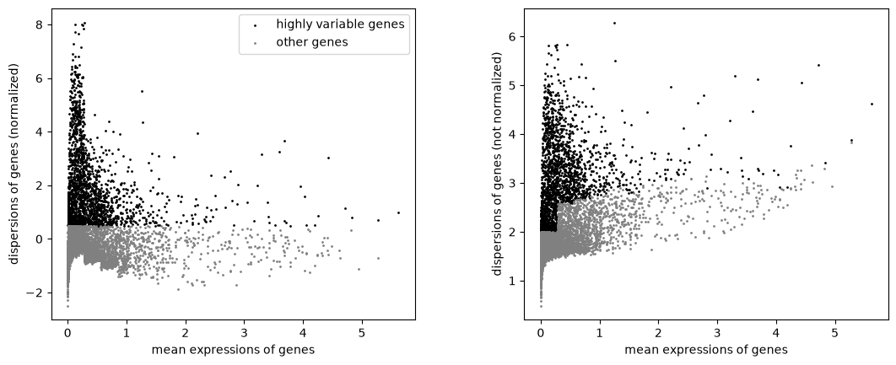
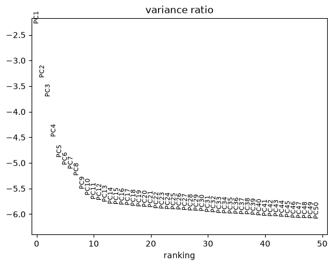
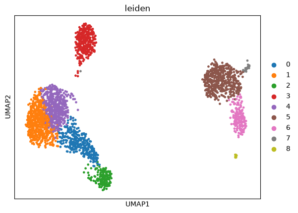
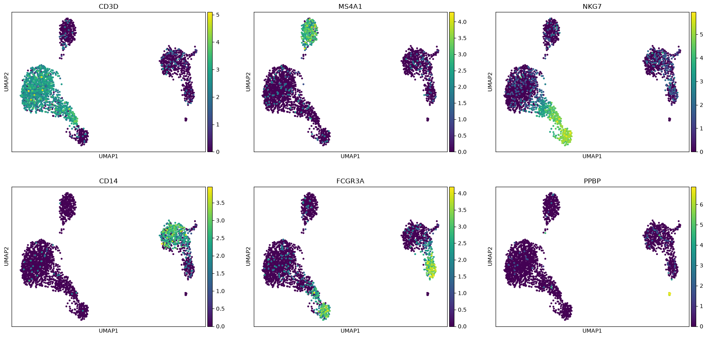
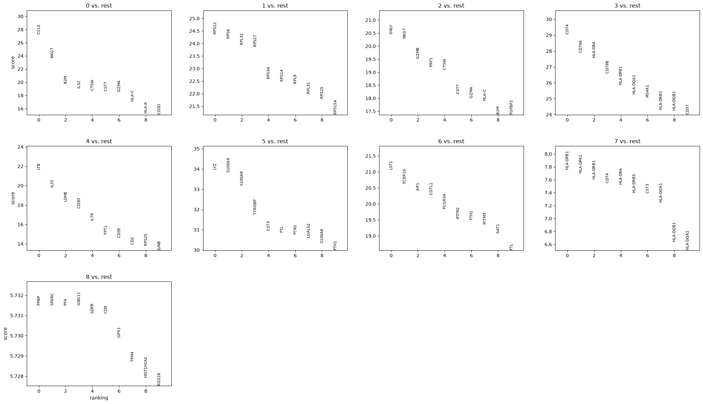

# PBMC 3k single-cell RNA-seq workflow (Scanpy)

A learning exercise: the standard single-cell RNA-seq workflow run end to end on the public PBMC 3k dataset, following the official Scanpy clustering tutorial. This is not original research.

## Data

Peripheral blood mononuclear cells from one healthy donor, released publicly by 10x Genomics. Loaded with `sc.datasets.pbmc3k()` as raw counts: 2,700 cells x 32,738 genes.

## Steps

1. **Quality control**: removed cells with fewer than 200 genes, 2,500 or more genes, or 5% or more mitochondrial counts; removed genes detected in fewer than 3 cells. Result: 2,638 cells x 13,714 genes.
2. **Normalization**: scaled each cell to 10,000 counts, then log(1 + x). Raw counts kept in `adata.layers["counts"]`.
3. **Feature selection**: top 2,000 highly variable genes.
4. **Dimensionality reduction**: PCA, neighbour graph, UMAP.
5. **Clustering**: Leiden algorithm, giving 9 clusters.
6. **Annotation**: known marker genes plus a Wilcoxon rank-sum test of each cluster against the rest.

## Result

| Cluster | Top markers | Cell type |
|---|---|---|
| 0 | CCL5, NKG7, GZMA, CD3D | Cytotoxic (CD8) T cells |
| 1 | Ribosomal genes (RPS12, RPS6, RPL32) | Naive CD4 T cells |
| 2 | GNLY, NKG7, GZMB, PRF1 | NK cells |
| 3 | CD74, CD79A, CD79B, MS4A1 | B cells |
| 4 | LTB, IL32, IL7R, CD3D | Memory CD4 T cells |
| 5 | LYZ, S100A9, S100A8 | Classical (CD14) monocytes |
| 6 | LST1, FCER1G, FCGR3A | Non-classical (CD16) monocytes |
| 7 | HLA-DPB1, HLA-DRA, CD74, CST3 | Dendritic cells |
| 8 | PPBP, PF4 | Platelets |

Cluster numbers depend on the software versions and may differ on a re-run.

## Figures

**Quality control** (genes per cell, counts per cell, mitochondrial percentage)



**Highly variable genes**



**PCA variance explained**



**UMAP coloured by Leiden cluster**



**UMAP coloured by known marker genes**



**Top marker genes per cluster** (Wilcoxon, cluster vs rest)



## Part 2: cell-type classifier in PyTorch

At the end of `pbmc3k.ipynb`, the Leiden cluster labels are used to train models that predict a cell's cluster from its expression of the 2,000 highly variable genes.

- **Data split:** 2,110 cells for training, 528 held out for testing (80/20, stratified by cluster, `random_state=0`).
- **Baseline:** logistic regression (scikit-learn, default settings, `max_iter=1000`).
- **Model B:** feed-forward neural network in PyTorch: 2,000 inputs, one hidden layer of 64 units with ReLU, 9 outputs; cross-entropy loss, Adam optimizer (learning rate 0.001), 100 full-batch epochs.
- **Model C:** the same network with dropout (0.5) and weight decay (0.001) to reduce overfitting.

| Model | Training accuracy | Test accuracy |
|---|---|---|
| Logistic regression (baseline) | not measured | 92.4% |
| Neural network (B) | 100% | 85.8% |
| Neural network with dropout and weight decay (C) | 100% | 87.5% |

Both networks overfitted (perfect training accuracy, lower test accuracy). Regularization helped slightly, but the simple baseline remained the best model for this small dataset.

Caveats: the labels are clusters computed from the same data, so the task partly reproduces the clustering rather than testing biological knowledge. The comparison rests on a single train/test split; cross-validation would give a more reliable estimate.

PyTorch (CPU build) was installed separately:

    .\sc\Scripts\python -m pip install torch --index-url https://download.pytorch.org/whl/cpu

## Limitations

- One donor, so no batch integration and no comparison between conditions.
- Cluster-vs-rest p-values are inflated: cells from one donor are not independent replicates, and the clusters were defined from the same data. They are used here only to rank markers.
- QC thresholds were chosen by eye for healthy blood and would not transfer directly to tumour tissue.
- The annotation of cluster 1 as naive CD4 T cells rests on its position among the T cells and its lack of distinctive markers, not on a specific marker.

## Reproduce

Python 3.13.16, Scanpy 1.12.4 (Windows).

```bash
py -m venv sc
.\sc\Scripts\python -m pip install -r requirements.txt
```

Then open `pbmc3k.ipynb`, select the `sc` environment as the kernel, and run all cells.
